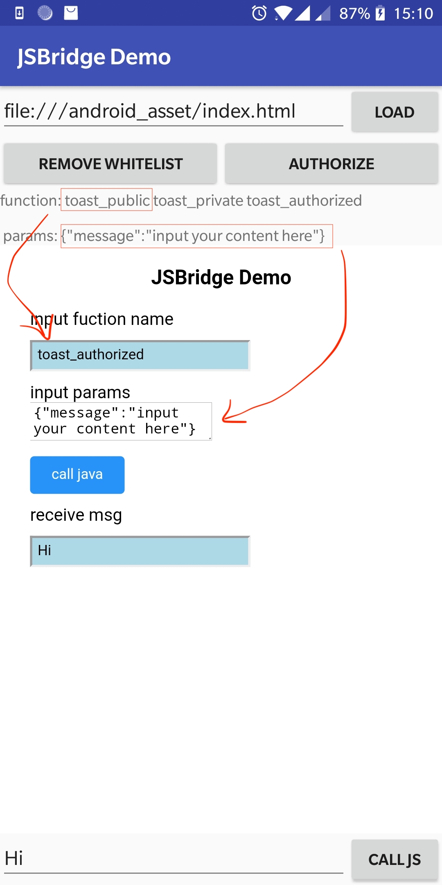

# XWebViewAssistant 文档

### 概述

XWebViewAssistant 提供给Android开发者更简单的WebView开发方式，基于Android原生`WebView`，轻量封装相关操作

- 链式调用，初始化`WebView` 更简洁
- 无`Activity`或者`Fragment` 基类，不需要继承，在任何页面都可以直接使用
- 自动绑定生命周期，无需手动操作，避免内存泄露
- 支持`JSBridge` ，内部实现为`@JavascriptInterface` ，提供权限校验，前端回调管理，支持同步和异步回调
- 支持 Cookie 同步

### 依赖

在根目录build.gradle下添加代码

```groovy
allprojects {
	repositories {
		...
		maven { url 'https://jitpack.io' }
	}
}
```

在项目build.gradle

`latest-version` 请在release-note中查看

```java
dependencies {
	implementation 'com.github.JoeSteven:XWebViewAssistant:latest-version'
}
```

### 使用文档

- [基本用法](./use.md)
- [Js Bridge](./jsbridge.md)
- [Cookies](./cookies.md)

[todo](./todo.md)

### 示例

- 可以通过输入框输入url进行加载


- add whitelist 和 authorize  这两个按钮分别可以将当前网站加入到白名单或者方法授权


- function: 后面有三个注册的Java方法，分别对应三种不同的权限，public都可以调用，private需要加入白名单可调用， authorized需要白名单或者授权可以调用。


- params：后面为三个方法的参数，json格式
- 最底部输入框为Java调用 js的sample

**该sample的前端调试页面放在asset目录中，你也可以在接入该库的时候使用这个页面进行本地调试，该页面由猴哥-[Jaeger](https://github.com/laobie) 友情赞助**



